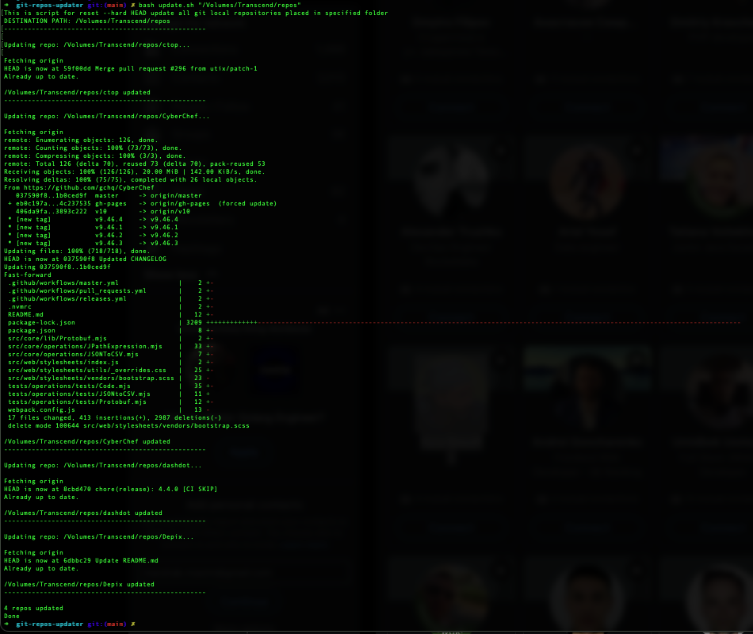

# github-repos-updater

Shell script for update all GitHub repositories placed in specified folder

### Purposes:

This script helps to automatically update all repositories located in a specific folder from remote repositories.

This is typically needed in a situation where you have many repositories cloned locally into a folder, such as a collection of various utilities, and you want to update all repositories to the latest version from a remote repository.

This script does three simple things on each repository in the source folder:

> git fetch --all
> 
> git reset --hard HEAD
> 
> git pull

### That's all!

*It works with GitHub, GitLab, BitBucket or your remote Git Server.

### Important!

get reset --hard HEAD removes all changes made so far locally! 

Be careful not to lose your data!

It is recommended to apply this script only to collections of local repositories that are not actively edited.

### Usage:

1. Clone this repository
2. Change repository="/Volumes/Transcend/repos" to the folder with repositories you need in repos-update.sh
3. Run bash repost-update.sh
4. Bingo!

